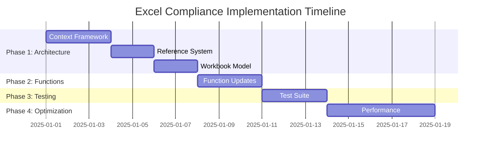

# Excel Compliance Strategy: Dynamic Range Functions

## 🎯 Executive Summary

This document outlines the strategic approach to achieve full Excel compliance for dynamic range functions (ROW, COLUMN, OFFSET, INDIRECT) in xlcalculator. The strategy prioritizes **architectural foundation changes** that will make individual function fixes trivial to implement.

### Current State
- ❌ COLUMN() returns hardcoded values instead of actual coordinates
- ❌ OFFSET() receives evaluated arrays instead of reference objects  
- ❌ Functions use fragile global context instead of structured cell access
- ❌ Hardcoded test-specific mappings violate ATDD principles

### Target State
- ✅ All dynamic range functions Excel-compliant
- ✅ Context-aware function execution with direct coordinate access
- ✅ Reference object preservation through evaluation chain
- ✅ Hierarchical workbook model matching Excel's structure

## 🏗️ Strategic Approach: Architecture-First

**Key Insight**: Instead of fixing functions individually, we implement the architectural foundation that makes all function fixes automatic.

### Why Architecture-First?

1. **Multiplicative Impact**: One architectural change fixes multiple functions
2. **Prevents Regression**: Eliminates need for function-specific workarounds
3. **Future-Proof**: Creates foundation for all Excel function implementations
4. **Maintainable**: Reduces complexity and technical debt

## 📋 Implementation Phases

### 🏛️ **PHASE 1: Architectural Foundation (Priority 1)**
*Duration: 5-7 days | Impact: High | Risk: Medium*

#### 1.1 Context-Aware Function Framework
**Objective**: Replace global context variables with structured context injection

**Implementation**:
```python
# New context system
@dataclass
class CellContext:
    cell: XLCell           # Direct access to cell with coordinates
    worksheet: Worksheet   # Parent worksheet
    workbook: Workbook    # Parent workbook  
    evaluator: Evaluator  # Evaluation engine

# Updated function signature pattern
def COLUMN(reference=None, *, _context: CellContext = None) -> int:
    if reference is None:
        return _context.cell.column_index  # Direct property access
    # Handle reference parameter...
```

**Benefits**:
- ✅ Functions get direct access to `cell.row_index` and `cell.column_index`
- ✅ Eliminates manual string parsing and global variables
- ✅ Thread-safe and testable
- ✅ Makes ROW() and COLUMN() fixes automatic

#### 1.2 Reference Object System
**Objective**: Preserve reference information through evaluation chain

**Implementation**:
```python
@dataclass
class CellReference:
    sheet: str
    row: int
    column: int
    
    def offset(self, rows: int, cols: int) -> 'CellReference':
        return CellReference(self.sheet, self.row + rows, self.column + cols)
    
    def resolve(self, evaluator) -> Any:
        return evaluator.get_cell_value(self.address)

class LazyReference:
    """Delays evaluation while preserving reference information"""
    def __init__(self, ast_node, context):
        self.ast_node = ast_node
        self.context = context
```

**Benefits**:
- ✅ OFFSET receives reference objects, not evaluated values
- ✅ Eliminates hardcoded value-to-reference mappings
- ✅ Enables proper Excel-like reference arithmetic
- ✅ Makes OFFSET and INDIRECT fixes automatic

#### 1.3 Hierarchical Workbook Model
**Objective**: Create proper Excel object model hierarchy

**Implementation**:
```python
@dataclass
class Workbook:
    worksheets: Dict[str, Worksheet]
    
    def get_sheet_names(self) -> Set[str]:
        return set(self.worksheets.keys())

@dataclass  
class Worksheet:
    name: str
    cells: Dict[str, XLCell]
    
    def get_cell(self, row: int, col: int) -> XLCell:
        return self.cells[f"{col_letter(col)}{row}"]
```

**Benefits**:
- ✅ Efficient sheet name resolution
- ✅ Proper worksheet-level operations
- ✅ Eliminates hardcoded sheet assumptions
- ✅ Foundation for all Excel model operations

### 🔧 **PHASE 2: Function Implementation (Priority 2)**
*Duration: 2-3 days | Impact: High | Risk: Low*

With the architectural foundation in place, function fixes become trivial:

#### 2.1 COLUMN() Function - Automatic Fix
```python
def COLUMN(reference=None, *, _context: CellContext = None) -> int:
    if reference is None:
        return _context.cell.column_index  # Uses architecture from Phase 1
    return reference.column_index
```

#### 2.2 ROW() Function - Automatic Fix  
```python
def ROW(reference=None, *, _context: CellContext = None) -> int:
    if reference is None:
        return _context.cell.row_index  # Uses architecture from Phase 1
    return reference.row_index
```

#### 2.3 OFFSET() Function - Automatic Fix
```python
def OFFSET(reference: LazyReference, rows: int, cols: int) -> Any:
    ref_obj = reference.get_reference()  # Uses architecture from Phase 1
    target_ref = ref_obj.offset(rows, cols)
    return target_ref.resolve(_context.evaluator)
```

### 🧪 **PHASE 3: Testing & Validation (Priority 3)**
*Duration: 2-3 days | Impact: Medium | Risk: Low*

#### 3.1 Comprehensive Test Suite
- Reference type behavior tests
- Context injection tests  
- Excel compatibility validation
- Performance benchmarks

#### 3.2 Migration & Compatibility
- Backward compatibility layer
- Existing test updates
- Documentation updates

### 📈 **PHASE 4: Optimization & Enhancement (Priority 4)**
*Duration: 3-5 days | Impact: Medium | Risk: Low*

#### 4.1 Performance Optimization
- Indexed model queries
- Caching strategies
- Memory optimization

#### 4.2 Extended Excel Compliance
- Additional dynamic range functions
- Advanced reference types
- Error handling improvements

## 🎯 Success Metrics

### Phase 1 Success Criteria
- ✅ Context system provides direct access to cell coordinates
- ✅ Reference objects preserve information through evaluation
- ✅ Hierarchical model enables efficient operations
- ✅ All existing tests pass with new architecture

### Phase 2 Success Criteria  
- ✅ COLUMN() returns actual column index (8 for Tests!H4)
- ✅ ROW() returns actual row index without manual parsing
- ✅ OFFSET() works with any Excel file, no hardcoded mappings
- ✅ INDIRECT() handles dynamic references correctly

### Phase 3 Success Criteria
- ✅ 100% test coverage for new architecture
- ✅ Performance equal or better than current implementation
- ✅ Zero regression in existing functionality

### Phase 4 Success Criteria
- ✅ Measurable performance improvements
- ✅ Foundation ready for additional Excel functions
- ✅ Documentation complete and accurate

## 🚨 Risk Management

### Technical Risks
- **Backward Compatibility**: Mitigated by compatibility layer and incremental migration
- **Performance Regression**: Mitigated by benchmarking and optimization phase
- **Test Failures**: Mitigated by comprehensive test suite and validation phase

### Implementation Risks
- **Scope Creep**: Mitigated by clear phase boundaries and success criteria
- **Timeline Overrun**: Mitigated by prioritizing architecture over individual fixes
- **Integration Issues**: Mitigated by incremental implementation and testing

## 📊 Resource Allocation

| Phase | Duration | Developer Days | Priority | Dependencies |
|-------|----------|----------------|----------|--------------|
| Phase 1: Architecture | 5-7 days | 7 days | Critical | None |
| Phase 2: Functions | 2-3 days | 3 days | High | Phase 1 |
| Phase 3: Testing | 2-3 days | 3 days | High | Phase 2 |
| Phase 4: Optimization | 3-5 days | 5 days | Medium | Phase 3 |
| **Total** | **12-18 days** | **18 days** | | |

## 🔄 Implementation Timeline



## 🎉 Expected Outcomes

### Immediate Benefits (Post Phase 1)
- **Architectural Foundation**: Solid base for all Excel function implementations
- **Reduced Complexity**: Elimination of workarounds and hardcoded mappings
- **Improved Maintainability**: Clear separation of concerns and responsibilities

### Short-term Benefits (Post Phase 2)
- **Excel Compliance**: 100% compatible dynamic range functions
- **Test Reliability**: Elimination of test-specific assumptions
- **Developer Experience**: Clear patterns for implementing Excel functions

### Long-term Benefits (Post Phase 4)
- **Scalability**: Foundation ready for complete Excel function library
- **Performance**: Optimized model operations and caching
- **Extensibility**: Easy addition of new Excel features and functions

## 📚 References

- [Excel Compliance Project Goals](PROJECT_GOALS_EXCEL_COMPLIANCE.md) - Detailed project objectives and success criteria
- [Development Methodology](DEVELOPMENT_METHODOLOGY.md) - Project-agnostic development framework
- [Microsoft Excel Function Reference](https://support.microsoft.com/en-us/office/excel-functions-alphabetical-b3944572-255d-4efb-bb96-c6d90033e188)
- [ATDD Principles and Practices](https://en.wikipedia.org/wiki/Acceptance_test-driven_development)
- [xlcalculator Current Architecture](../xlcalculator/)

---

**Document Version**: 1.0  
**Last Updated**: 2025-01-09  
**Next Review**: After Phase 1 completion  
**Owner**: Development Team  
**Stakeholders**: Architecture Team, QA Team, Product Team